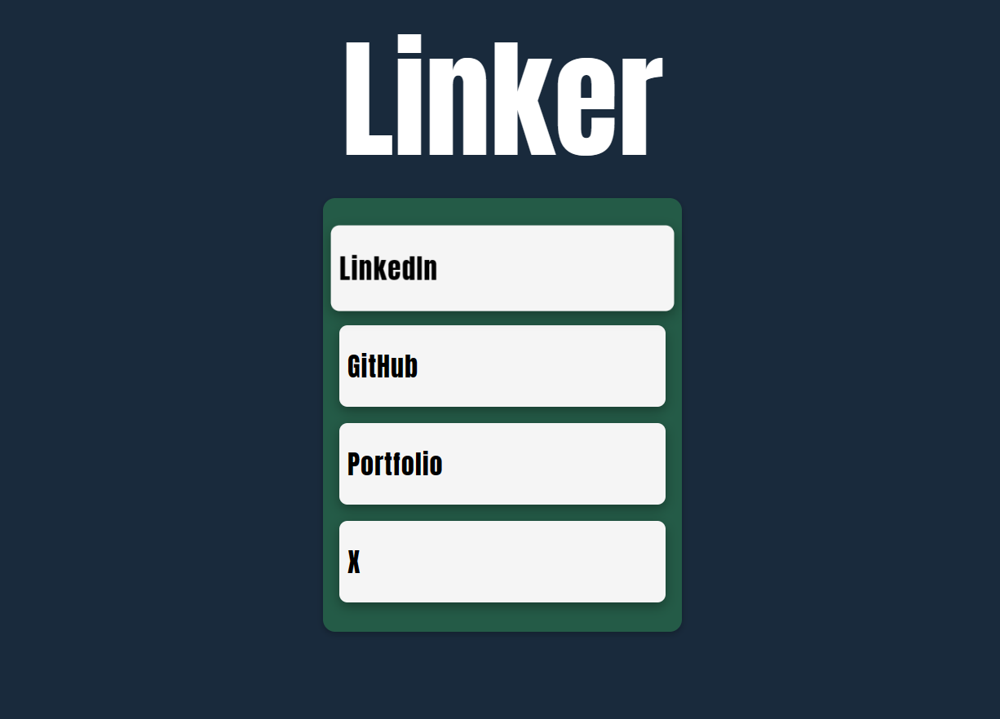

## Linker

Linker is a simple web application built with Vanilla TypeScript and Vite, aimed at replicating the functionality of Linktree. It contains a single page containing multiple links that can be copied easily on click.

